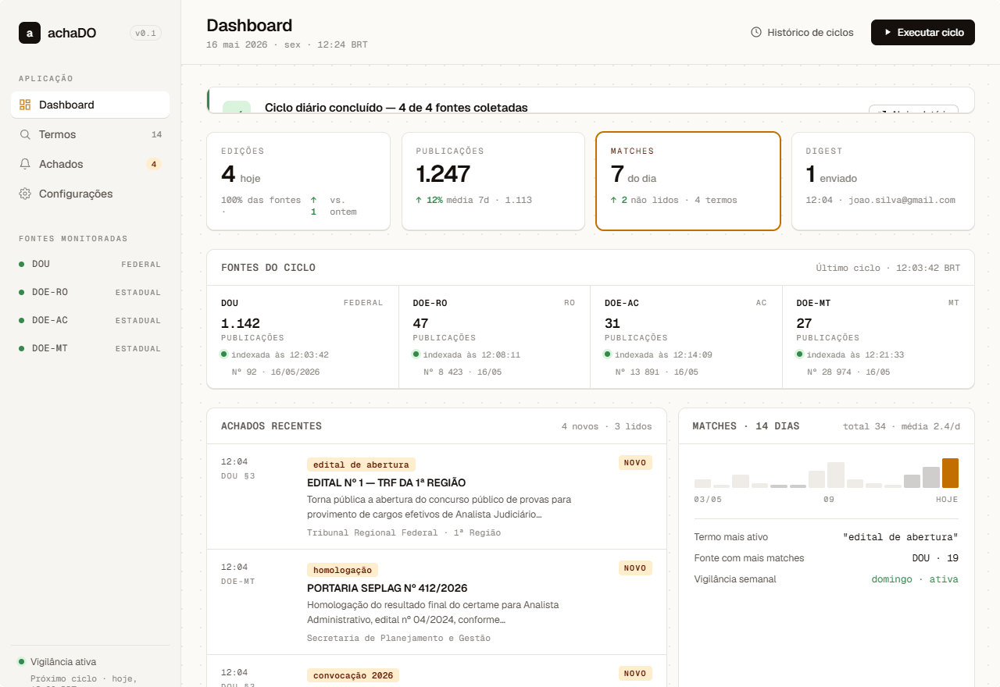
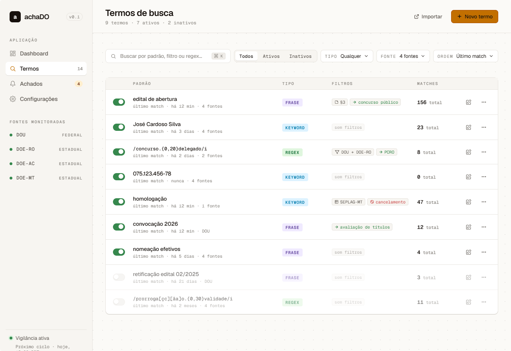
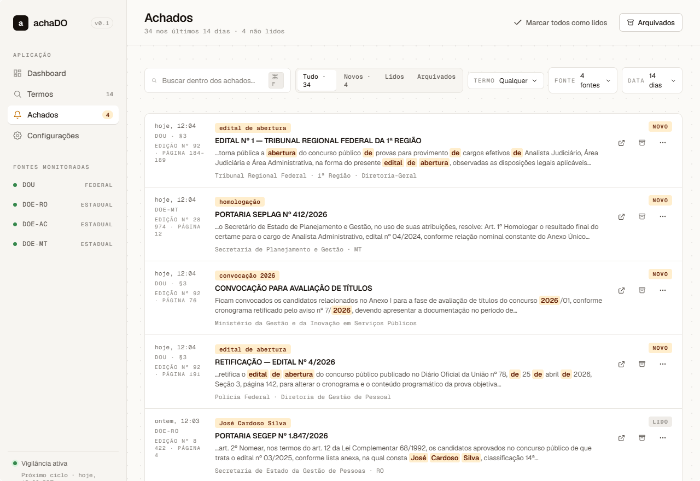
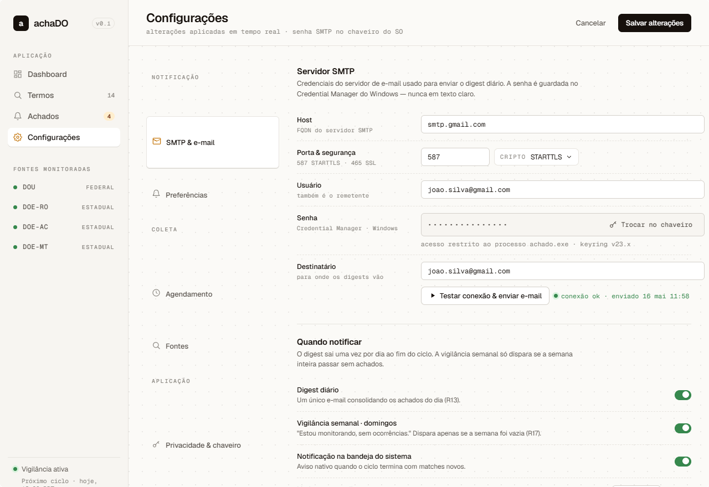

# AchaDO

> Monitore Diários Oficiais do Brasil sem esforço.

O **AchaDO** é uma aplicação desktop pessoal que coleta, indexa e monitora automaticamente o **Diário Oficial da União** e os **Diários Oficiais dos estados de Rondônia, Acre e Mato Grosso**. Defina os termos que importam para você — nomes, CPFs, números de edital, cargos, órgãos — e seja avisado por e-mail assim que aparecerem em qualquer publicação oficial dentro desse escopo.

Chega de acessar dezenas de sites diferentes, baixar PDFs manualmente e fazer buscas uma a uma. O AchaDO faz isso por você, todos os dias, em segundo plano.

## Prévia

| Dashboard | Termos de busca |
|---|---|
|  |  |

| Achados | Configurações |
|---|---|
|  |  |

## Documentação

- 📄 **[Requisitos do produto (PRD)](./docs/PRD.md)** — para quem é, problema que resolve, funcionalidades planejadas e métricas de sucesso.
- 🏗️ **[Arquitetura](./docs/ARCHITECTURE.md)** — componentes, fluxo de informação, modelo de dados, stack tecnológica e decisões técnicas, com diagramas.

## Para quem é

O AchaDO é construído pensando em **concurseiros** — quem precisa acompanhar editais, retificações, convocações, resultados, homologações, nomeações e prorrogações no Diário Oficial. Também é útil para advogados, empresas que seguem licitações, jornalistas e qualquer pessoa interessada em ser notificada quando um nome ou termo aparecer em publicações oficiais.

Detalhes completos sobre público-alvo e casos de uso estão no [PRD](./docs/PRD.md#para-quem-é).

## Status do projeto

> Em planejamento. Este repositório contém a concepção do produto. O desenvolvimento ainda não começou.

Contribuições, sugestões e relatos de quem já enfrentou esse problema são muito bem-vindos nas Issues.

## Instalação e uso

> Instruções de instalação e uso serão adicionadas conforme o desenvolvimento avançar.

## Contribuindo

Como o projeto ainda está em fase de concepção, a melhor forma de contribuir agora é:

- Abrir uma Issue descrevendo seu caso de uso (concurso que você acompanha, termos que monitora, fontes que consulta)
- Sugerir Diários Oficiais que devem ter prioridade de implementação
- Propor decisões técnicas comentando em Issues marcadas com `discussão`

## Licença

Licença a definir antes da primeira release.

---

*AchaDO — porque ninguém deveria perder um edital por causa de um PDF não lido.*
