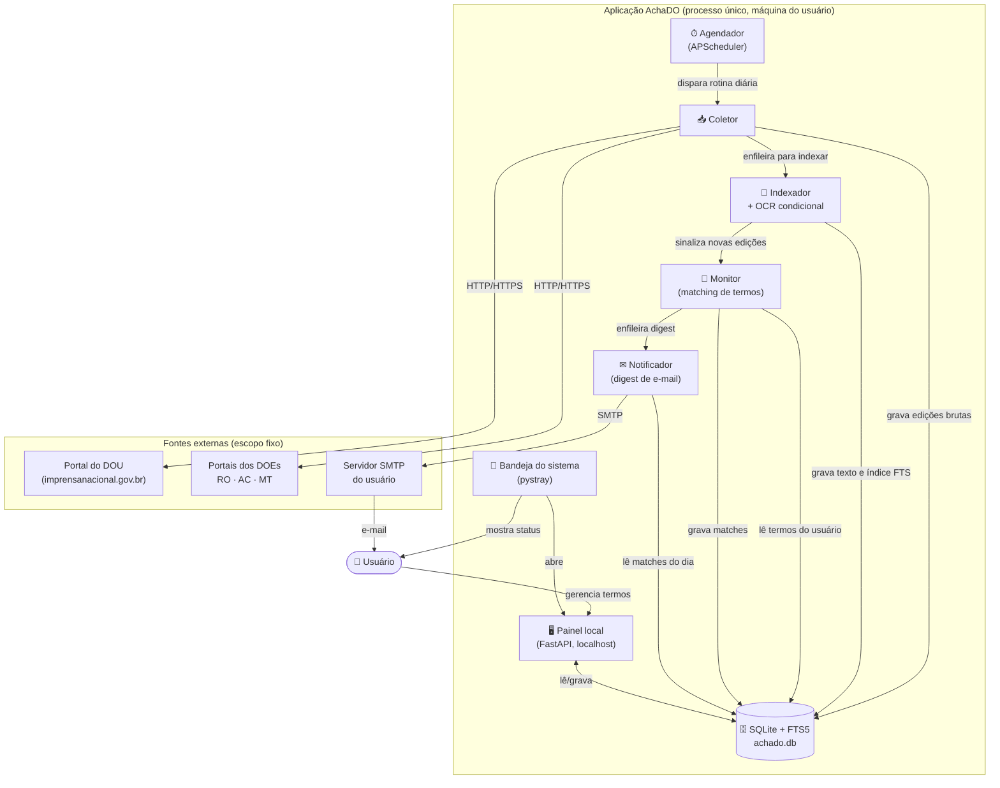
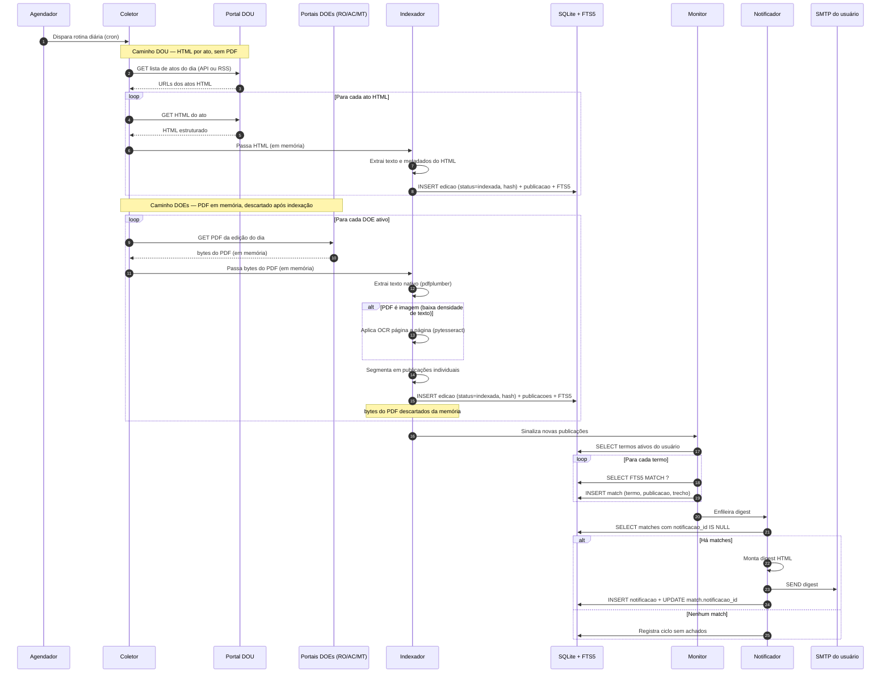
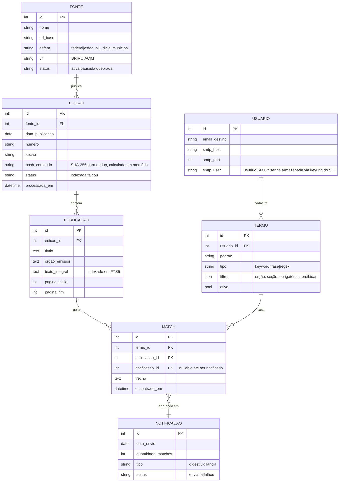

# Arquitetura — AchaDO

← [Voltar ao README](../README.md)

---

Este documento descreve **como** o AchaDO é construído: componentes, fluxo de informação, decisões técnicas e modelo de dados. Para entender **o que** o produto faz e **para quem**, consulte o [PRD](./PRD.md).

## Sumário

- [Visão geral](#visão-geral)
- [Diagrama de componentes](#diagrama-de-componentes)
- [Fluxo diário (sequência)](#fluxo-diário-sequência)
- [Modelo de dados](#modelo-de-dados)
- [Componentes em detalhe](#componentes-em-detalhe)
- [Stack tecnológica](#stack-tecnológica)
- [Estrutura de pastas](#estrutura-de-pastas)
- [Princípios de design](#princípios-de-design)
- [Versionamento do schema](#versionamento-do-schema)
- [Ciclo de vida e agendamento](#ciclo-de-vida-e-agendamento)
- [Observabilidade](#observabilidade)
- [Decisões arquiteturais relevantes](#decisões-arquiteturais-relevantes)

## Visão geral

O AchaDO é uma aplicação **monolítica desktop** escrita em Python, executada como um único processo na máquina do usuário. Não há servidor central, nem comunicação cliente-servidor com infraestrutura externa: tudo o que o usuário precisa (banco, índice, agendador, interface) roda localmente. A única dependência externa em tempo de execução é a saída para os portais dos Diários Oficiais dentro do escopo (entrada de dados) e o servidor SMTP do próprio usuário (saída de notificações).

O conjunto de fontes oficiais monitoradas é **fixo por regra de produto** e consiste em quatro portais: o Diário Oficial da União (DOU) e os Diários Oficiais dos estados de Rondônia (DOE-RO), Acre (DOE-AC) e Mato Grosso (DOE-MT). Detalhes em [PRD — Escopo de fontes](./PRD.md#escopo-de-fontes).

Internamente, o sistema é estruturado em quatro componentes funcionais (Coletor, Indexador, Monitor, Notificador) coordenados por um agendador, que escrevem e leem de um único arquivo SQLite e que são configurados/inspecionados por um painel web local servido em `localhost`.

**Estratégia de coleta por fonte.** Para reduzir consumo de rede, disco e CPU, o Coletor adota abordagens diferentes por fonte: o DOU publica cada ato individualmente como página HTML (e oferece API pública), dispensando o download do PDF da edição completa; os DOEs estaduais (RO, AC, MT) publicam apenas em PDF, que é baixado em memória, processado e descartado sem gravação em disco. **Nenhum PDF é armazenado localmente** — somente o texto extraído persiste no SQLite.

## Diagrama de componentes

Visão estática do sistema. Mostra os componentes, as dependências externas e o caminho dos dados entre eles.



## Fluxo diário (sequência)

Sequência temporal do pipeline disparado uma vez por dia útil. Mostra a ordem das operações e onde cada componente entrega para o próximo.



## Modelo de dados

Entidades centrais e seus relacionamentos. O banco é um único arquivo SQLite com FTS5 ativado.



> **Nota — FONTE.** A tabela `FONTE` é populada por **seed fixo** com exatamente dez linhas: DOU, DOE-RO, DOE-AC, DOE-MT, DJ-RO, DJ-AC, DJ-MT, DOM-PVH, DOM-RBR e DOM-CGB. Ela é modelada como entidade (e não como enum) para permitir armazenar metadados úteis (URL base, calendário, último sucesso de coleta), mas o conjunto de linhas não é editável pelo usuário — refletindo a [regra de escopo](./PRD.md#escopo-de-fontes).
>
> **Nota — USUARIO.** A entidade `USUARIO` existe principalmente para isolamento de configuração e para suportar (no roadmap) o compartilhamento de listas de termos. No MVP, há apenas um usuário por instalação.

## Componentes em detalhe

### Coletor

**Responsabilidade.** Manter o banco de edições atualizado para cada fonte ativa, sem perder dias e sem duplicar trabalho.

**Conjunto de fontes (fixo).** O Coletor trabalha sobre um conjunto fechado de dez fontes, definido como [regra de negócio do produto](./PRD.md#fontes-monitoradas): DOU, DOE-RO/AC/MT, DJ-RO/AC/MT e DOM-PVH/RBR/CGB. Cada fonte tem uma classe `Adapter` específica responsável por conhecer o calendário de publicação, a URL das edições e o formato. Adicionar uma nova fonte exige código novo e decisão de produto — não é configuração de usuário.

**Comportamento por tipo de fonte.**

*DOU (HTML por ato):*
- Consulta a API pública ou RSS da Imprensa Nacional para obter a lista de atos publicados no dia.
- Para cada ato, faz GET da página HTML individual com `httpx`.
- Passa o HTML (em memória) diretamente para o Indexador. Nenhum arquivo é gravado em disco.

*DOEs — RO, AC, MT / DJs — RO, AC, MT / DOMs — Porto Velho, Rio Branco, Cuiabá (PDF em memória):*
- Descobre a URL da edição do dia a partir do calendário ou página de listagem do portal.
- Baixa o PDF com `httpx` **diretamente para um buffer em memória** (`bytes`). Para portais que exigem JavaScript, usa `playwright` e captura o PDF via download interceptado.
- Passa os bytes para o Indexador. **Os bytes são descartados da memória após o Indexador concluir** — nenhum PDF é salvo em disco.

*Deduplicação (ambos os caminhos):*
- Calcula SHA-256 do conteúdo recebido (HTML ou bytes do PDF) antes de enfileirar para o Indexador.
- Se o hash já existe em `EDICAO`, a edição é ignorada — detecta republicações e conteúdo duplicado por URLs diferentes.

*Tolerância a falhas (ambos os caminhos):*
- Em falha de rede: **retry com backoff exponencial** (4 tentativas, intervalo inicial de 30 s).
- Em falha persistente: marca a fonte como `quebrada` no banco e segue para a próxima — uma fonte com problema não interrompe o ciclo das outras.

**Saída.** O Coletor não grava arquivos em disco. Entrega conteúdo em memória ao Indexador; é o Indexador que registra a linha em `EDICAO` (com `status=indexada` ou `status=falhou`) após concluir o processamento.

### Indexador

**Responsabilidade.** Converter cada edição baixada em texto pesquisável e populá-lo no índice FTS5.

**Comportamento por tipo de entrada.**

*Caminho DOU (HTML):*
- Recebe o HTML de um ato individual do Coletor.
- Extrai texto e metadados (título, órgão emissor, seção) diretamente da estrutura HTML — sem PDF, sem OCR.
- Cada ato HTML já corresponde a uma única `PUBLICACAO`; não é necessária segmentação.

*Caminho DOEs (bytes de PDF em memória):*
- Recebe os bytes do PDF do Coletor (nunca um caminho de arquivo).
- Tenta extrair texto nativo com `pdfplumber`.
- **OCR condicional.** Se uma página retorna menos de 200 caracteres (heurística por densidade), aciona `pytesseract` nessa página. Evita rodar OCR — a operação mais cara — em páginas com texto embutido.
- Segmenta o texto em publicações individuais com heurísticas encapsuladas no `Adapter` de cada DOE: padrões de cabeçalho em caixa alta, densidade de linhas em branco; fallback para página inteira quando nenhum separador é detectado.
- Após extração, os bytes do PDF **saem de escopo e são coletados pelo GC** — sem gravação em disco.

*Ambos os caminhos:*
- Insere cada publicação em `PUBLICACAO` e no índice FTS5 (`publicacao_fts`).
- Insere a linha em `EDICAO` com `status=indexada` (ou `status=falhou` em caso de erro irrecuperável).

**Sobre o FTS5.** A tabela virtual usa o tokenizer `unicode61` com `remove_diacritics=2` para tornar buscas insensíveis a acentos — essencial para nomes próprios e termos jurídicos em português.

### Monitor

**Responsabilidade.** Detectar quando uma publicação recém-indexada casa com algum termo cadastrado.

**Comportamento.**
- Carrega os termos `ativos` do banco.
- Para cada termo, monta uma consulta FTS5 conforme o tipo:
  - `keyword` → `MATCH 'palavra'`
  - `frase` → `MATCH '"frase exata"'`
  - `regex` → consulta FTS5 sem filtro de termo (retorna candidatos da publicação inteira) seguida de pós-filtro `re.search()` em Python; `LIKE` do SQLite não suporta regex e não deve ser usado aqui.
- Aplica os **filtros adicionais** do termo (órgão emissor, seção, expressões obrigatórias/proibidas) como pós-filtro Python sobre os candidatos retornados pelo FTS5.
- Cada match resulta em uma linha em `MATCH` com o trecho contextual (~300 caracteres ao redor da ocorrência) preservado para uso no e-mail.

### Notificador

**Responsabilidade.** Consolidar os matches do dia em um e-mail útil para o usuário, sem repetir nada já notificado.

**Comportamento.**
- Coleta os `MATCH` do dia com `notificacao_id IS NULL` (ainda não vinculados a nenhuma notificação).
- Agrupa por termo e por publicação (evita o caso "mesmo termo apareceu 8 vezes na mesma publicação" virar 8 itens separados).
- Monta um e-mail HTML com:
  - Resumo no topo (X achados em Y publicações, distribuídos por termo).
  - Para cada match: termo que disparou, trecho destacado, órgão emissor, link direto para a edição original (no portal da fonte) e link para abrir a publicação no painel local.
- Envia via SMTP usando as credenciais do próprio usuário.
- Em sucesso, insere uma linha em `NOTIFICACAO` e atualiza `MATCH.notificacao_id` com o id gerado — vinculando os matches à notificação enviada.
- Em falha de envio, nenhum match é vinculado; eles permanecem com `notificacao_id IS NULL` e são retentados no próximo ciclo (idempotência por ausência de FK).

**E-mail de vigilância semanal (domingos).** Um segundo job, executado todo domingo após o ciclo diário, verifica se houve algum `MATCH` nos últimos sete dias. Se não houve nenhum, envia um e-mail de confirmação de vigilância informando que a aplicação está ativa e monitorando, mas não encontrou ocorrências na semana. Esse e-mail é registrado em `NOTIFICACAO` com `tipo=vigilancia` e `quantidade_matches=0`. Não é enviado em semanas que já tiveram pelo menos um digest com achados (`tipo=digest`).

## Stack tecnológica

| Camada | Tecnologia | Por quê |
|---|---|---|
| Linguagem | Python 3.11+ | Melhor ecossistema para scraping, PDF e OCR |
| Coleta HTTP | `httpx` + `beautifulsoup4` / `lxml` | Cliente assíncrono moderno + parser robusto |
| Coleta dinâmica | `playwright` (quando necessário) | Para sites que exigem JavaScript |
| Extração de PDF | `pdfplumber` | Texto de PDFs em memória — usado apenas para DOEs; DOU usa HTML |
| OCR | `pytesseract` (Tesseract) | Para páginas de PDF sem texto embutido (DOEs), gratuito e offline |
| Banco e índice | SQLite com FTS5 | Sem servidor, arquivo único, busca full-text nativa |
| Agendamento | `APScheduler` (com `coalesce=True`, `misfire_grace_time=None`) | Rotina diária no próprio processo; detecta e executa jobs perdidos na inicialização |
| Auto-start no Windows | `winreg` (registro `HKCU\Software\Microsoft\Windows\CurrentVersion\Run`) | Registra o `.exe` na inicialização do Windows durante a instalação |
| Notificação por e-mail | `smtplib` + `email.message` | Padrão da linguagem, sem dependências externas |
| Credenciais SMTP | `keyring` | Armazena senha no chaveiro nativo do SO (Credential Manager no Windows, Keychain no macOS) — nunca em texto claro no banco |
| Bandeja do sistema | `pystray` + `plyer` | Ícone na tray + notificações nativas do Windows |
| Painel local | FastAPI + HTMX (ou similar) | Gerenciar termos e revisar achados em `localhost` |
| Diretórios de dados | `platformdirs` | Resolve caminhos de dados/cache/logs por plataforma (`%APPDATA%` no Windows) |
| Empacotamento | PyInstaller | Distribuição como `.exe` único para uso pessoal |

**Princípios da escolha.** Tudo local, tudo offline-capable, sem servidor central, sem custo recorrente e sem dependência de serviços pagos. SQLite com FTS5 cobre o caso de uso pessoal com folga e elimina a complexidade de operar um índice externo.

## Estrutura de pastas

A estrutura de pastas segue o layout `src/` do Python e espelha diretamente os quatro componentes funcionais. Cada componente é um subpacote independente; os adapters de cada fonte ficam dentro do `collector/`, isolados entre si.

```
achaDO/
│
├── pyproject.toml               # Dependências e configuração do projeto
├── .gitignore
├── README.md
├── docs/
│   ├── PRD.md
│   └── ARCHITECTURE.md
│
├── migrations/                  # Scripts SQL numerados de migração de schema
│   ├── 001_initial_schema.sql
│   └── 002_*.sql
│
├── src/
│   └── achado/                  # Pacote principal
│       ├── __init__.py
│       ├── __main__.py          # Entry point: python -m achado
│       ├── app.py               # Bootstrap: inicia scheduler, tray e painel
│       ├── db.py                # Conexão SQLite e apply_migrations()
│       └── config.py            # Leitura de configuração (platformdirs, keyring)
│       │
│       ├── collector/           # Coletor — download por fonte
│       │   ├── __init__.py
│       │   ├── base.py          # Classe abstrata Adapter (interface comum)
│       │   ├── dou.py           # Adapter DOU — HTML por ato via API/scraping
│       │   ├── doe_ro.py        # Adapter DOE-RO — PDF em memória
│       │   ├── doe_ac.py        # Adapter DOE-AC — PDF em memória
│       │   ├── doe_mt.py        # Adapter DOE-MT — PDF em memória
│       │   ├── dj_ro.py         # Adapter DJ-RO (TJ-RO) — PDF em memória
│       │   ├── dj_ac.py         # Adapter DJ-AC (TJ-AC) — PDF em memória
│       │   ├── dj_mt.py         # Adapter DJ-MT (TJ-MT) — PDF em memória
│       │   ├── dom_pvh.py       # Adapter DOM Porto Velho — PDF em memória
│       │   ├── dom_rbr.py       # Adapter DOM Rio Branco — PDF em memória
│       │   └── dom_cgb.py       # Adapter DOM Cuiabá — PDF em memória
│       │
│       ├── indexer/             # Indexador — extração de texto e FTS5
│       │   ├── __init__.py
│       │   ├── html.py          # Extração de texto de HTML (DOU)
│       │   ├── pdf.py           # Extração de texto de PDF + OCR condicional (DOEs)
│       │   └── segmenter.py     # Segmentação de publicações individuais
│       │
│       ├── monitor/             # Monitor — matching de termos
│       │   ├── __init__.py
│       │   └── matcher.py       # FTS5 MATCH + pós-filtro re.search() para regex
│       │
│       ├── notifier/            # Notificador — digest de e-mail
│       │   ├── __init__.py
│       │   ├── digest.py        # Montagem do HTML do e-mail
│       │   └── smtp.py          # Envio via smtplib + leitura de senha do keyring
│       │
│       ├── scheduler/           # Agendador — coordena o pipeline diário
│       │   ├── __init__.py
│       │   └── jobs.py          # Definição e registro dos jobs APScheduler
│       │
│       ├── panel/               # Painel local — interface FastAPI em localhost
│       │   ├── __init__.py
│       │   ├── main.py          # Instância FastAPI e configuração de rotas
│       │   ├── routes/
│       │   │   ├── __init__.py
│       │   │   ├── dashboard.py # Tela: status do último ciclo
│       │   │   ├── terms.py     # Tela: CRUD de termos de busca
│       │   │   ├── findings.py  # Tela: histórico de achados
│       │   │   └── settings.py  # Tela: SMTP e preferências
│       │   └── templates/       # Templates HTML (HTMX)
│       │       ├── base.html
│       │       ├── dashboard.html
│       │       ├── terms.html
│       │       ├── findings.html
│       │       └── settings.html
│       │
│       └── tray/                # Bandeja do sistema
│           ├── __init__.py
│           ├── icon.py          # Ícone pystray + menu de contexto
│           └── assets/
│               └── icon.png     # Ícone da aplicação na bandeja
│
└── tests/                       # Testes — espelha a estrutura de src/achado/
    ├── conftest.py              # Fixtures compartilhadas (banco em memória, etc.)
    ├── collector/
    │   ├── test_dou.py
    │   ├── test_doe_ro.py
    │   ├── test_doe_ac.py
    │   └── test_doe_mt.py
    ├── indexer/
    │   ├── test_html.py
    │   ├── test_pdf.py
    │   └── test_segmenter.py
    ├── monitor/
    │   └── test_matcher.py
    └── notifier/
        └── test_digest.py
```

**Convenções:**
- Cada componente (`collector`, `indexer`, `monitor`, `notifier`, `scheduler`, `panel`, `tray`) é um subpacote com `__init__.py` que expõe apenas a interface pública do componente — os demais módulos são detalhes internos.
- `base.py` no `collector/` define o contrato `Adapter` que todos os adapters de fonte implementam. Adicionar uma quinta fonte significa criar um novo arquivo `doe_xx.py` sem tocar nos demais.
- `tests/` espelha a estrutura de `src/achado/` para facilitar navegação. Fixtures de banco de dados (SQLite em memória) ficam centralizadas em `conftest.py`.

## Princípios de design

Estas premissas guiam as decisões técnicas e de produto. Elas refletem os requisitos não-funcionais documentados no [PRD](./PRD.md#requisitos-não-funcionais).

1. **Pessoal por padrão.** A aplicação roda no computador do usuário. Não há servidor central nem coleta de dados pessoais. Lista de termos e histórico ficam apenas no computador do usuário.
2. **Tolerante a falhas.** Sites de Diários Oficiais saem do ar, mudam layout, mudam URL. O coletor tem retries, backoff e relata falhas sem interromper o resto da rotina.
3. **Frugal com recursos.** Roda em segundo plano em um notebook comum, sem pesar no uso diário.
4. **Transparente.** O usuário sempre consegue ver de onde veio cada alerta, qual edição foi consultada e qual trecho disparou a notificação.
5. **Sem dependência de serviços pagos.** O projeto é viável usando apenas ferramentas gratuitas e fontes públicas oficiais.

## Versionamento do schema

O banco SQLite usa `PRAGMA user_version` como número de versão do schema. Ao iniciar, a aplicação lê o valor atual e executa sequencialmente os scripts de migração pendentes (ex.: `migrations/002_add_notificacao_id.sql`) até o schema estar na versão esperada pelo binário. Não há dependência de Alembic ou qualquer ferramenta de migração externa — isso mantém a distribuição como `.exe` simples e sem dependências de runtime adicionais.

A responsabilidade de executar migrações fica em uma função `apply_migrations(conn, target_version)` chamada na inicialização da aplicação, antes de qualquer outra operação no banco.

## Ciclo de vida e agendamento

Esta seção detalha como as [regras de execução autônoma do PRD](./PRD.md#execução-autônoma) são implementadas.

**Auto-start no Windows.** Durante a instalação, o `.exe` é registrado em `HKCU\Software\Microsoft\Windows\CurrentVersion\Run` via `winreg`. Isso garante que o processo suba automaticamente com o login do usuário, sem privilégios de administrador (chave `HKCU`, não `HKLM`).

**Horário e fuso do ciclo diário.** O job é agendado por padrão para **12:00 no fuso `America/Sao_Paulo`** (horário de Brasília), independentemente do fuso configurado no sistema operacional do usuário. O fuso é sempre especificado explicitamente no APScheduler — nunca inferido do SO. O usuário pode alterar o horário pela tela de Configurações; o fuso permanece fixo em `America/Sao_Paulo`.

```python
# Job diário — executa todos os dias às 12h00 BRT
scheduler.add_job(
    pipeline_diario,
    trigger=CronTrigger(hour=12, minute=0, timezone="America/Sao_Paulo"),
    id="ciclo_diario",
    coalesce=True,
    misfire_grace_time=None,
)

# Job semanal — executa todo domingo após o ciclo diário (12h15 BRT)
# Envia e-mail de vigilância se nenhum match foi encontrado nos últimos 7 dias
scheduler.add_job(
    verificacao_semanal,
    trigger=CronTrigger(day_of_week="sun", hour=12, minute=15, timezone="America/Sao_Paulo"),
    id="vigilancia_semanal",
    coalesce=True,
    misfire_grace_time=None,
)
```

**Recuperação de jobs perdidos.** O APScheduler é configurado com:
- `coalesce=True` — se múltiplos disparos foram perdidos (ex.: PC ficou desligado vários dias), executa apenas uma vez ao retomar, não N vezes.
- `misfire_grace_time=None` — remove o limite de tempo para considerar um job como "expirado"; o job perdido é sempre executado ao inicializar, independentemente de quantas horas se passaram.

**Idempotência diária (uma execução por dia).** O APScheduler por si só não garante "exatamente uma vez por dia" quando combinado com recuperação de jobs perdidos e múltiplos reinicios. A garantia é feita pelo banco: ao iniciar o job, a aplicação verifica se já existe um registro de `NOTIFICACAO` (ou ciclo sem achados) para a data de hoje em `EDICAO`. Se sim, o job é abortado imediatamente. Isso evita dupla execução em cenários como: PC ligado → job roda → PC reiniciado no mesmo dia → job não roda de novo.

## Observabilidade

**Logging.** A aplicação usa `loguru` com as seguintes configurações:

- Arquivo de log rotativo em `platformdirs.user_data_dir("AchaDO")/logs/achado.log`, rotação diária, retenção de 30 dias.
- Nível padrão: `INFO`. Ativado em nível `DEBUG` com a flag `--debug` na linha de comando.
- Cada rotina do agendador abre um contexto de log com `logger.contextualize(ciclo=data)` para que todas as mensagens do ciclo diário fiquem rastreáveis.

**Status visível ao usuário.** O ícone na bandeja do sistema reflete o estado do último ciclo: ✅ concluído sem falhas, ⚠️ concluído com falhas em alguma fonte, ❌ falha crítica. O painel local (Dashboard) exibe o log resumido do último ciclo com timestamp, fontes coletadas e quantidade de matches encontrados.

## Decisões arquiteturais relevantes

**Por que SQLite com FTS5 e não Elasticsearch / Meilisearch.** O caso de uso é uma única máquina, um único usuário, volume estimado de algumas centenas de MB a poucos GB de texto por ano. Um índice externo adicionaria operação, instalação e RAM sem ganho prático para o volume previsto. FTS5 oferece tokenização configurável, busca por frase, snippets e ranking BM25 — tudo que o produto precisa, em um arquivo único.

**Por que processo único e não pipeline distribuído.** O AchaDO é uma aplicação pessoal. Filas externas (Redis, RabbitMQ) ou workers separados criam dependências de instalação e complicam o empacotamento como `.exe`. A coordenação entre Coletor → Indexador → Monitor → Notificador é feita pelo próprio scheduler in-process, usando o banco como fila implícita (`status` da edição) — simples, sem componentes adicionais.

**Por que OCR condicional e não sempre.** OCR é a operação mais cara do pipeline (várias ordens de magnitude mais lenta que extração nativa). Grande parte das edições do DOU já tem texto embutido. Acionar OCR apenas quando a extração nativa falha (heurística por densidade de caracteres) preserva o princípio de frugalidade com recursos.

**Por que dedup por hash de arquivo.** Diários Oficiais às vezes republicam a mesma edição ou disponibilizam o mesmo conteúdo por URLs diferentes (edição extra, retificação que substitui PDF). O SHA-256 do conteúdo bruto detecta duplicatas independentemente da URL, evitando indexar o mesmo material duas vezes e duplicar notificações.

**Por que não salvar PDF em disco.** O PDF da edição é a forma mais pesada de entrada do sistema — edições do DOU completo podem ter centenas de MB. Salvar em cache cria acúmulo crescente de dados que raramente são acessados novamente (o texto já está no SQLite). Para o DOU, o problema desaparece completamente: o portal publica cada ato como HTML individual, dispensando o download da edição completa. Para os DOEs, o PDF é baixado em memória, processado e descartado — o único custo é de rede no dia da publicação, com impacto zero em disco. A desvantagem é que uma falha de indexação exige novo download no próximo ciclo, o que é aceitável dado o custo baixo do re-download comparado ao acúmulo de GBs em disco.

**Por que HTML/API para o DOU e PDF para os DOEs.** O DOU é a fonte mais volumosa e a que mais cresce: a Imprensa Nacional publica cada ato administrativo como página HTML individual em `in.gov.br` e mantém uma API pública de busca. Usar HTML por ato elimina o download de PDFs de centenas de páginas para encontrar um ato de 2 parágrafos. Os DOEs estaduais (RO, AC, MT) não oferecem granularidade equivalente — publicam a edição completa apenas em PDF. A estratégia híbrida adota o caminho mais leve para cada fonte sem comprometer a cobertura.

**Por que painel web local e não GUI nativa.** Uma UI web servida em `localhost` reaproveita o navegador já instalado, evita o trabalho de manter widgets nativos por SO e permite que o painel evolua independentemente do binário. O ícone na bandeja serve apenas como atalho para abrir o painel e exibir status.

---

← [Voltar ao README](../README.md) · [← PRD](./PRD.md)
